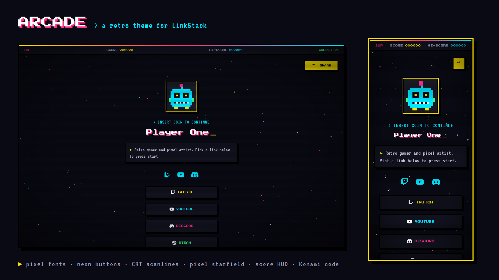

# A LinkStack Theme
Find more themes: https://github.com/LinkStackOrg/linkstack-themes

*	Theme Name: Arcade
*	Theme Version: 1.0
*	Theme Date: 2026-09-23
*	Theme Author: PaulPio
*	Theme Author URI: https://github.com/PaulPio
*	Theme License: GPLv3
*	Source code: https://github.com/PaulPio/LinkstackArcadeTheme

A dark retro arcade theme for LinkStack: pixel fonts, neon buttons and CRT vibes.

### Features
* Pixel fonts: Press Start 2P for the name and buttons, VT323 for text. Both are bundled, so no Google Fonts requests.
* Neon buttons (yellow, cyan, pink, green) with hard black shadows. They press down on hover and a blinking ▶ cursor appears next to the selected one.
* `> INSERT COIN TO CONTINUE` prompt, a blinking cursor after your name, and the bio shown as a game dialog box.
* A square "sprite frame" avatar.
* A pixel starfield that scrolls down and twinkles, plus CRT scanlines.
* 8-bit style animations: buttons spawn one after another, and icons hop on hover.
* Respects `prefers-reduced-motion`.

### Extras (need custom code)
These run through the files in `extra/`. For them to work, the LinkStack server needs `ALLOW_CUSTOM_CODE_IN_THEMES=true` in its `.env` file. Without that, the theme looks the same but the extras are missing.

* **Score HUD**: a `1UP / SCORE / HI-SCORE / CREDIT 01` bar at the top. Every link click adds +100, and the visitor's best score is saved in their browser.
* **8-bit sound**: a short, quiet square-wave blip when a link is clicked.
* **Konami code**: typing ↑ ↑ ↓ ↓ ← → ← → B A turns on turbo mode, with rainbow buttons and warp-speed stars.

Each extra can be turned off in `config.php`:

| Option | Default | What it does |
|---|---|---|
| `enable_hud` | `'true'` | Score bar at the top |
| `enable_sfx` | `'true'` | Click sound |
| `enable_konami` | `'true'` | Konami code turbo mode |
| `disable_scanlines` | `'false'` | Set to `'true'` to remove the CRT scanlines |

Buttons from the Button Editor use the Arcade style (`allow_custom_buttons` is `'false'`), so every link matches.

### Used assets:
* Built using:
* https://github.com/dhg/Skeleton
* License: MIT

* Built from:
* https://github.com/LinkStackOrg/linkstack-default-theme
* License: GPLv3

* Font: Press Start 2P by CodeMan38
* https://fonts.google.com/specimen/Press+Start+2P
* License: SIL Open Font License 1.1 (extra/custom-assets/fonts/OFL.txt)

* Font: VT323 by Peter Hull
* https://fonts.google.com/specimen/VT323
* License: SIL Open Font License 1.1 (extra/custom-assets/fonts/OFL.txt)
